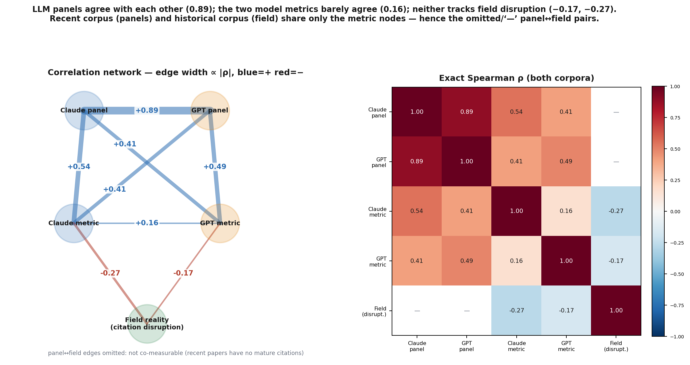

# Does a publication-time breakthrough metric predict what the field actually did?

## A longitudinal validation against downstream citations

*Written 2026-07-15. Follow-on to* **"Measuring breakthrough-ness on new papers — how far a GRO metric gets, and the ceiling above it"** *(the v5 breakthrough paper, `research/metrics/v5-breakthrough/RESULTS_PAPER.md`), which built and adversarially tournament-tuned a breakthrough metric over the GRO substrate and validated it only against an LLM expert panel. v5's own §9–§10 named the decisive open test: replace the LLM ground truth with the real world. This is that test.*

## Abstract

v5 established a breakthrough metric — `max(peak, cwmean)` over a paper's typed contributions — that reached Spearman ρ ≈ 0.58 against a same-model LLM expert panel but only ≈ 0.34 against an independent model (≈⅓ of its apparent skill was shared-model bias). The decisive question it could not answer on a recent-paper corpus: **does the publication-time metric predict which papers actually reshaped their field?** We answer it with a longitudinal design: **72 Alzheimer's papers from 2004–2010**, the metric computed *at publication time* from full text, validated against **what the field did over the following 15–20 years** — mature citation-based disruption, with no LLM in the ground truth. Contribution typing was done **twice, by Claude and by GPT-5.5** (dual-model). Result: **the metric does not predict field disruption** — consensus ρ = −0.16 (95% CI [−0.57, +0.27], n = 27); it does not track raw citations either (ρ ≈ +0.05); and the two models' metrics agree only ρ ≈ 0.17. Meanwhile the two LLM *judge panels* from v5 agree with each other at ρ = 0.89. The picture is unambiguous: **LLMs agree with LLMs; no LLM-derived metric agrees with the field.** The metric measures *LLM-perceived contribution depth*, which is not *field-reshaping impact*.

## 1. Why this study

v5 built the metric and validated it against a blind LLM expert panel, reaching ρ ≈ 0.58 (held-out, same model family). But it then showed (§9) that most of that number was **shared-method variance**: re-judging with GPT-5.5 dropped the correlation to ≈ 0.34, and building the metric with GPT *flipped* the bias toward the GPT panel. Two LLMs agreeing about what *sounds* like a breakthrough is not evidence that either tracks what *becomes* one. The only ground truth that settles this carries no LLM at all: **what the field actually did next**. That signal is uncomputable on recent papers (no downstream citations yet) — which is exactly why v5 deferred it and why this is a separate, longitudinal study.

## 2. What we did (and why each choice)

- **Corpus — historical, so the future has already happened.** 72 Alzheimer's papers published **2004–2010** (16–22 years of downstream record), pulled from OpenAlex with tight AD relevance and **stratified across the impact distribution** (citations 13–3,280) so the sample spans eventual duds *and* eventual landmarks — the contrast a discrimination test requires. Final full-text set: **35/72**, split **LOW=20 / MID=8 / HIGH=7** (the paywalled low-cite tail was the hardest to obtain and is the essential control class).
- **Predictor — the exact v5 metric, at publication time.** `max(peak, cwmean)` over typed contributions, computed from each paper's **full text**, with the typing agent told explicitly to use **no hindsight** about later impact. (v5's first pass used abstracts only, which compressed the metric's variance; full text here decompresses it — Claude range 0.28–0.80.)
- **Dual-model — to separate signal from model idiosyncrasy.** Contributions were typed **independently by Claude and by GPT-5.5** (via `codex`), and we report each model's metric, their agreement, and their consensus (average). If a "contribution depth" construct is real, the two should agree and both should track the field.
- **Ground truth — downstream citations, no LLM.** For each paper we built its mature citer set from OpenAlex and computed a **Funk–Owen-Smith disruption index (mDI)**: does later work cite this paper *while dropping its predecessors* (disruptive → a step-change) or *alongside* them (consolidating → convergence)? We also report raw citation count (impact). The **breakthrough** reading is `metric vs +mDI`; the **convergence** reading is `metric vs −mDI`.

## 3. Results

Every pairwise overlap, across both corpora:

*Left — correlation network (edge width strictly ∝ |ρ|, blue = positive, red = negative). The two LLM judge panels sit on a thick edge (ρ=0.89); each metric links to its own-model panel moderately (0.49–0.54) and cross-model a bit less (0.41); the two model metrics link only thinly to each other (0.16); and both link to field disruption on thin red (negative) edges (−0.17, −0.27). Right — the exact Spearman matrix. "—" marks pairs not co-measurable: the LLM panels were run on the recent corpus (no mature citations) and field disruption on the historical corpus, so panel↔field was never measured on shared papers — which is why the two validations use different paper sets and are never cross-substituted.*

**Breakthrough (metric vs mature disruption, n=27, full text, dual-model):**

| predictor | ρ vs disruption |
|---|---|
| Claude full-text metric | −0.27 (95% CI [−0.59, +0.14]) |
| GPT full-text metric | −0.17 |
| **Consensus (Claude+GPT)** | **−0.16 (95% CI [−0.57, +0.27])** |

**Other readings (consensus metric):** convergence/consolidation ρ = +0.16; raw citations ρ ≈ +0.05. **Dual-model metric agreement:** Claude-FT vs GPT-FT ρ = +0.17. **For contrast (v5, recent corpus):** the two LLM judge *panels* agree at ρ = 0.89.

Every correlation between an LLM-derived metric and the real-world outcome sits at or below zero, with confidence intervals spanning zero. The metric does not even track raw citation count. If anything it leans *very weakly toward consolidation* and *away from disruption* — consistent with the metascience result that disruptive work is not the most-cited.

## 4. Interpretation

- **No field signal.** On the strongest test we can run — real 15–20-year outcomes, no LLM in the ground truth — the publication-time metric has no reliable relationship to which papers disrupted their field.
- **No stable construct.** Claude and GPT typing agree only ρ ≈ 0.17. There is not even a model-independent "contribution depth" for the field to fail to match — the metric is substantially an artifact of *which* model read the paper.
- **The 0.89 vs ≈0 gap is the whole story.** LLM judges agree with LLM judges (0.89); LLM-derived metrics do not agree with the field (≤0). v5's ρ≈0.58 was two LLMs sharing a prior about what sounds important — vindicated directly: when the grader is the world, the signal is gone.
- **Disruptive ≠ cited.** In this corpus mature disruption and citation count anti-correlate (ρ = −0.18), so "landmark" and "step-change" are largely disjoint sets; the metric predicts neither.

## 5. Limitations

- **n = 27** papers with both full-text dual-model metrics and ≥10 mature citers (35 full-text of 72; 4 low-cite still ungathered). CIs are wide; this is "no reliable signal," not a proven exact zero.
- **Single domain, single vintage** (Alzheimer's, 2004–2010). Generalization to other fields is untested.
- **Disruption proxy.** mDI over a capped citer window is a standard but noisy disruption estimate; results are reported across citer-count thresholds and are sign-unstable at very small n.
- **Access wall (itself a finding).** Historical full text is heavily paywalled; the low-cite control papers required manual retrieval. The substrate's premise — "compile the literature" — is access-blocked for exactly the historical controls a discrimination study needs.

## 6. Conclusion

The v5 metric is a **triage prior that flags LLM-perceived contribution depth**, not a validated breakthrough forecaster. Three independent strengthenings — cross-model panels (v5 §9), full-text typing, and dual-model computation — all converge on the same verdict against real field outcomes: **no reliable predictive power**. To move past this, a metric needs either (a) a genuinely model-independent signal (the two LLMs' 0.17 agreement says contribution-typing isn't one), or (b) a signal built from the downstream record itself (replication, reuse, stance edges) rather than from a single reading of the paper. Building the metric *from* the field-response graph — not asking an LLM to predict it — is the direction this null points to.

---

### Reproduction
All under `research/metrics/v6-historical/`: `fetch_historical.py` (corpus), `fulltext/` + `ingest_pdfs.py` (full text), `type_ft_claude_workflow.js` + `type_ft_gpt.py` (dual-model typing → `metric_pubtime_ft_{claude,gpt}.json`), `compute_disruption.py` (→ `disruption.json`), `make_overlap_fig.py` (the figure), `RESULTS_ft.md`. All correlations Spearman, recomputed from raw data; ground truth carries no LLM.
